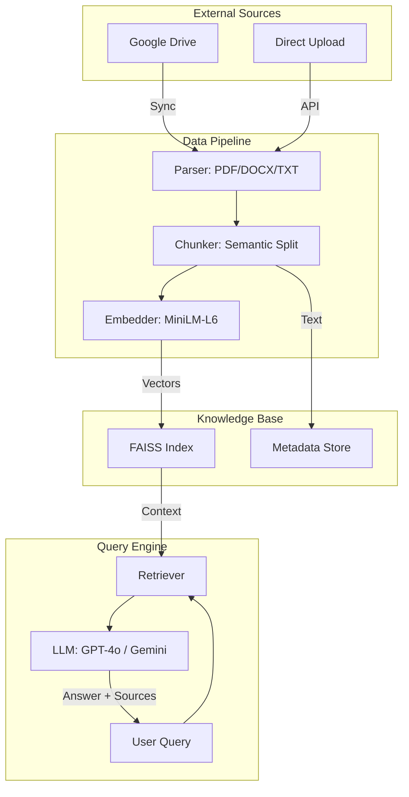

# 🔄 Highwatch RAG — Project Workflow

This document outlines the internal data flow and operational logic of the Highwatch RAG system.

---

## 1. High-Level Architecture

The system operates as a bridge between your **Google Drive** storage and an **LLM** (OpenAI/Gemini/Groq), using **FAISS** as a local high-performance memory.

---

## 2. Data Ingestion Workflow (POST `/sync-drive`)

This pipeline ensures your knowledge base is up-to-date with your Google Drive.

1.  **Authentication**: The `GoogleDriveConnector` uses OAuth2. If no valid `token.json` exists, it triggers a local browser flow to get permissions.
2.  **Incremental Listing**:
    *   The system fetches metadata for all files in the target folders.
    *   It compares the `modifiedTime` and `MD5 hash` against the local `sync_state.json`.
    *   **Logic**: Only files that are new or have changed are downloaded. Unchanged files are skipped to save bandwidth and compute.
3.  **Parsing**:
    *   **PDFs**: Uses `pdfplumber` to extract text and table data accurately.
    *   **Google Docs**: Exported to `.docx` on the fly and parsed.
    *   **Text**: Read directly with encoding detection.
4.  **Semantic Chunking**:
    *   The `TextChunker` splits documents by logical boundaries: `Sections` ➔ `Paragraphs` ➔ `Sentences`.
    *   It applies a **64-character overlap** between chunks to ensure the LLM doesn't lose context at the edges of a split.
5.  **Vectorization**:
    *   Chunks are sent in batches to the `SentenceTransformer` (`all-MiniLM-L6-v2`).
    *   Resulting 384-dimensional vectors are normalized for cosine similarity.
6.  **Storage**:
    *   Vectors are added to the **FAISS Index**.
    *   Metadata (file name, doc ID, text) is stored in a companion JSON store.
    *   The index is persisted to disk immediately.

---

## 3. Query Workflow (POST `/ask`)

This is the "Search & Answer" loop.

1.  **Query Embedding**: The user's question is converted into the same vector space as the documents using the embedding model.
2.  **Vector Search**:
    *   The system performs a **Cosine Similarity** search in the FAISS index.
    *   It retrieves the **Top K** (default 5) most relevant chunks.
    *   **Filtering**: If `filter_source` is provided, the system filters the results to that specific document.
3.  **Context Construction**:
    *   The retrieved text chunks are formatted into a single "Context Block".
    *   Each chunk is tagged with its source file name and relevance score.
4.  **LLM Grounding**:
    *   The Context + User Query are sent to the LLM with a strict **System Prompt**.
    *   **Constraint**: The LLM is instructed to *only* use the provided context and cite its sources.
5.  **Response Synthesis**:
    *   The LLM generates a natural language answer.
    *   The API returns the answer along with a list of unique sources and the raw text snippets for transparency.

---

## 4. Key Technical Decisions

| Component | Why it matters |
| :--- | :--- |
| **Incremental Sync** | Prevents redundant costs and time by only processing changed files. |
| **FAISS (IndexFlatIP)** | Provides lightning-fast search locally without needing an external database. |
| **Pydantic Settings** | Ensures the app fails fast if environment variables are missing or invalid. |
| **Structured Logging** | Makes debugging the pipeline easy in production environments. |
| **Async Threads** | Uses `asyncio.to_thread` for CPU-heavy tasks (like embedding), keeping the API responsive. |

---

## 5. Summary Table: Data States

| State | Format | Location |
| :--- | :--- | :--- |
| **Raw Source** | Google Drive API Object | Cloud |
| **Cached File** | `.pdf`, `.docx`, `.txt` | `./storage/downloads/` |
| **Chunked Text** | List of Strings | In-Memory / `documents.json` |
| **Knowledge** | 384-dim Vectors | `./storage/faiss_index.bin` |
| **Answer** | Markdown Text | API Response |
